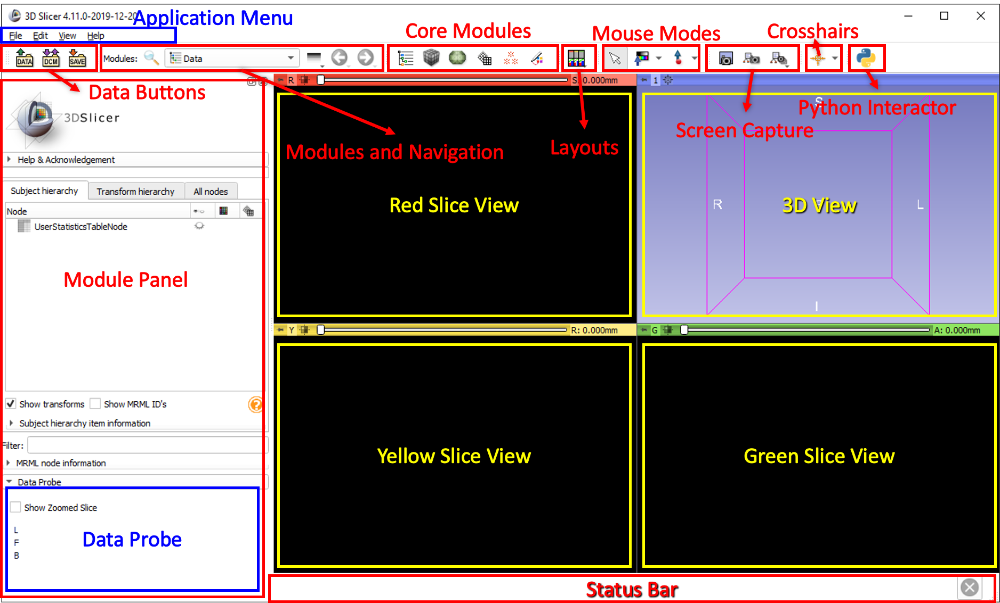
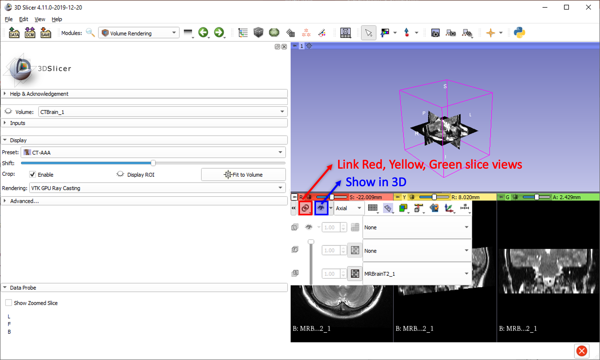
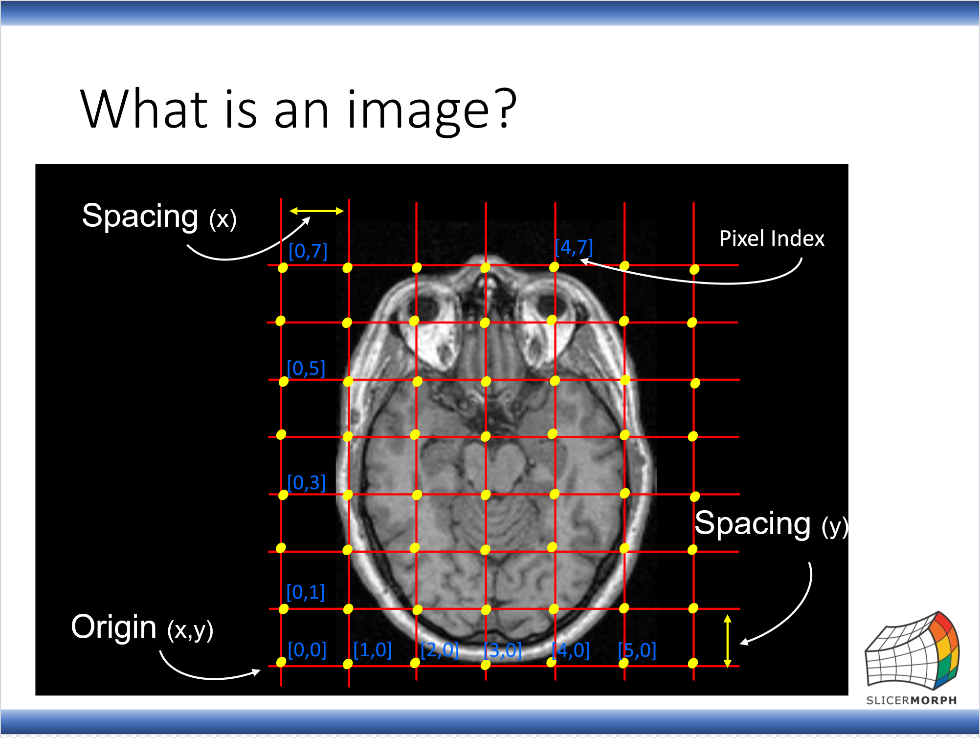
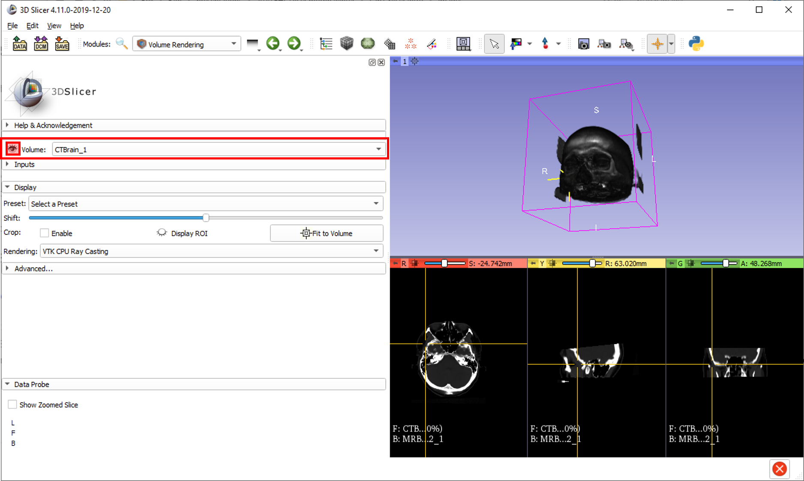
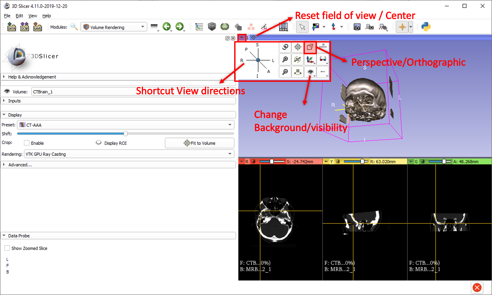
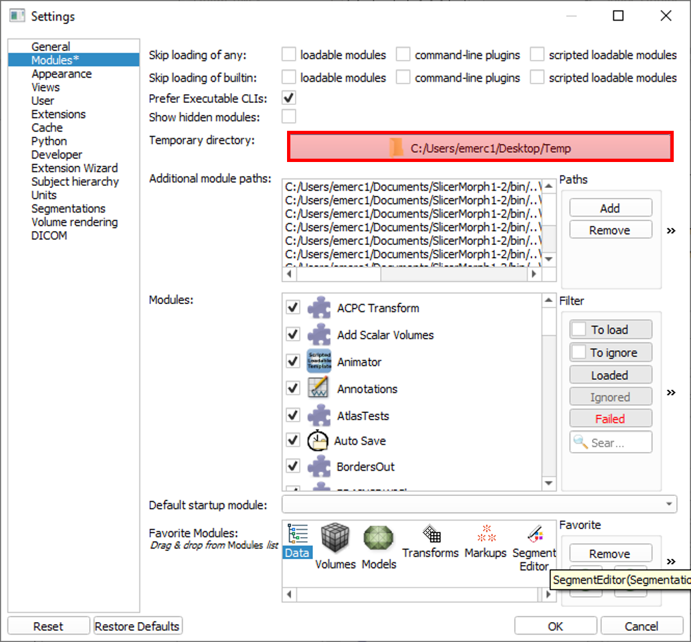
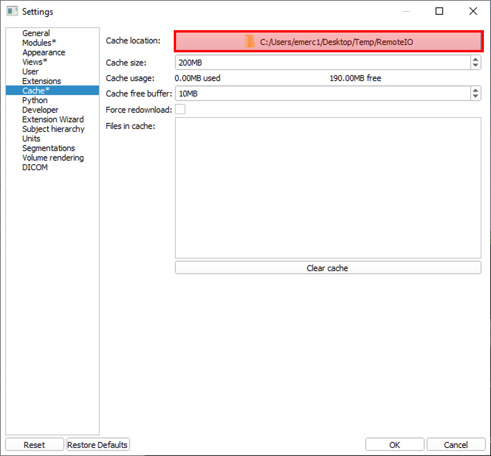
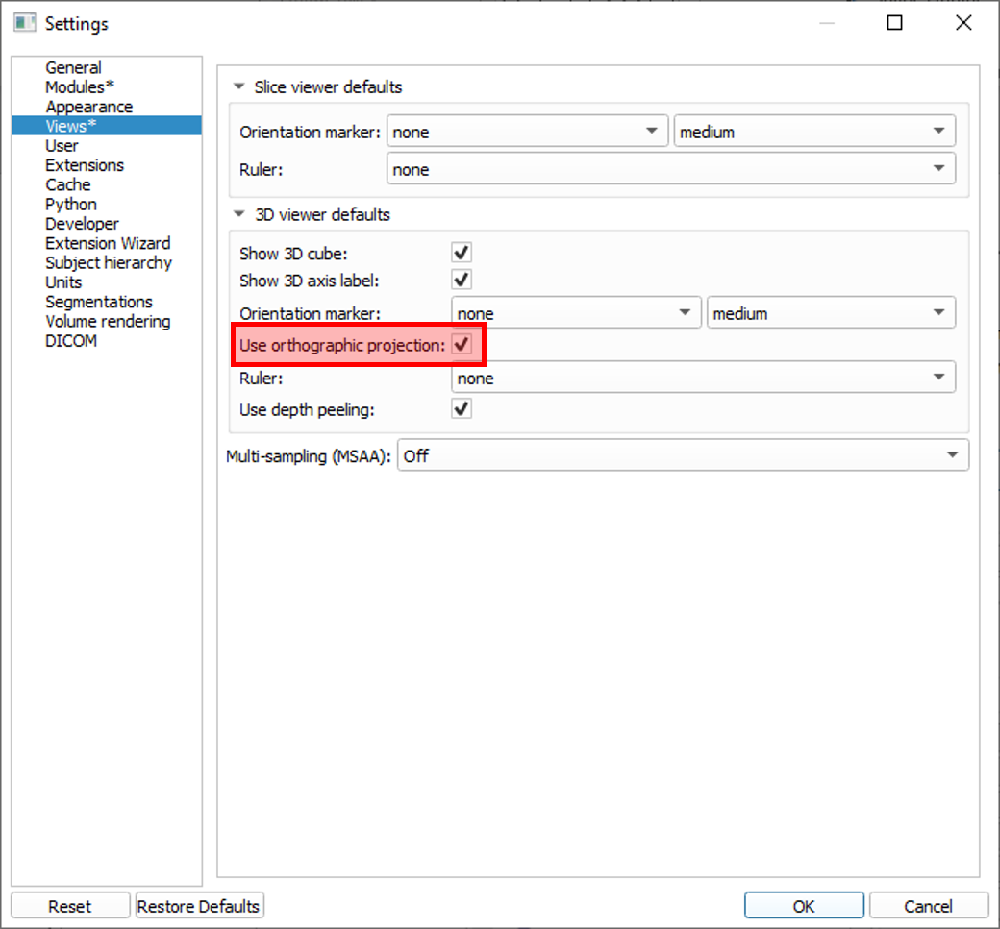
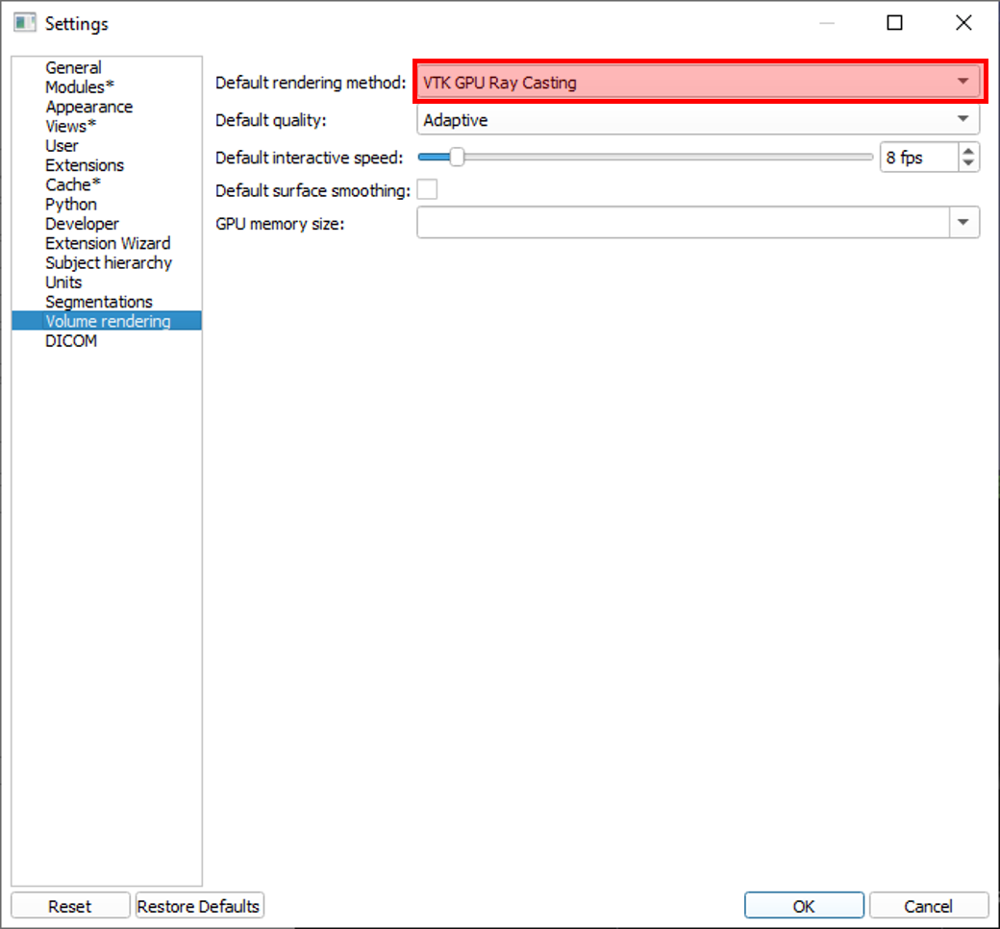

# Lab 01 Slicer #1: UI, overview of functionality, extensions, finding help 

Welcome to Slicer Lab #1! :tada::tada::tada:

Slicer is an open source software platform with a worldwide developwe community. It is being developed right now.
https://www.slicer.org/

## Slicer versus SlicerMorph 

In this workshop, we will use a custom Slicer with SlicerMorph extension and some modifications to existing modules. You can download it for Mac and Windows from: http://download.slicermorph.org. If you are a linux user, there is a PDF in the same URL that recounts the steps you need to do to obtain a customized SlicerMorph for Linux. 

Except for our geometric morphometrics modules, there is no functional difference between Slicer and SlicerMorph. We pre-bundle our tools and some useful other extensions with SlicerMorph so that installation steps are easier for you and you can immediately begin working with your data. Also, we test our tools more extensively against the Slicer version we customize. This makes sure that any development changes to the 3D Slicer does not break our functionality. We plan to update SlicerMorph in six months cycles so that the new futures added to Slicer are also incorporate to SlicerMorph.

Another benefit of SlicerMorph is that it is a portable installation. You can copy the root folder of the SlicerMorph to a USB drive and run from it on a new computer without having to install on it.

## General Application Window and UI
Related [wiki](https://www.slicer.org/wiki/Documentation/4.10/SlicerApplication/MainApplicationGUI).

* Load & Save buttons 
  * Add Data button - Show Options checkbox. 
  * Saving MRB - Medical Record Bundle
* ``DICOM`` module which will be covered in detail in lab #2. 
* SlicerMorph's ``ImageStacks`` module is the prefered way to load data from mCT scanner (will be covered in detail in lab #2).
  
:pencil2: Use "Add Data" button, locate the data you copied in pre-lab, and add "CT-brain.nrrd" to your workspace. Once done, minimize Slicer, open a file explorer and locate the data folder from pre-lab. Drag-and-drop "MR-brain-T1.nrrd" and "MR-brain-T2.nrrd" into Slicer. Add them to your workspace. 

:pencil2: Save a MRB of your workspace on your Desktop. Include all files. Clear your workspace by closing the scene (File > Close Scene or Ctrl+w). Load MRB by using "Add Data" button or drag-and-drop functionality. Is everything there?
  
* Module Selection and Navigation 
   * current module 
   * dropdown list of all available modules
   * search modules
   * module usage history
   * navigation through module usage history
    
* Core Modules
* Layout options: Depending on your job, different Layouts for the visualization are useful. 
   
   :pencil2: Change the layout to "Conventional".
   
* Mouse modes:
  * Translate/rotate
  * Window/Level 
  * Annotation
  
   :pencil2: Adjust the Window/Level of the image globally and auto-adjust by selecting a region (hold down Shift key or select the option from the drow-down menu).
  
* Screen Capture
* Crosshair visibility

* Phyton Interactor: Lab #9 - scripting in Python

## Views: Slice and 3D
   
   * 3D Slicer is all about slices and 3D renderings/models (more about them in Lab #3 and #4). Conventional layout gives you 3 slice views and a 3D rendering (reconstruction) view.
   
   * Slices: red (axial: inferior to superior), yellow (sagittal: left to right) and green (coronal: posterior to anterior) slices. Usually data is acquired in one slice (most commonly axial) and the other slices are *reconstructed*. Slice views give you the capability to move through slices using a slider (or the wheel of your mouse). It tells you which slice you are seeing in the *physical space* (mm).
   * Little *push-pin* on the top-left corner hides a panel of additional functionality. If you hover over it, it shows the panel; if you click on it, it pins the panel so it stays open. 
   * If you *link* the slices, then changes you make in this panel affects all three slice views. The closed *eye* icon is for visibility. 
   * If you click on the eye and open the eye, the slice will be visible in 3D view. If you already linked the slice views, all 3 will be visible in 3D. Go ahead and play with it. Change the slice (using the slider or the mouse wheel) and rotate the 3D view to experiment.
   
   
   
   * There is a double arrow button on the top left corner of this panel, you can open even more options and expand this panel. You can add a foreground volume (like a label-map or another volume you loaded) and change the transparency. 
   
   :pencil2: Select another volume as your background (MRBrainT1 or CTBrain) and play with the transparency.
   
## Data Probe

It shows the location of the mouse indicator, the pixel values in the image, label-map (more about this in Lab #3 - segmentation) etc.
   
## ``Data`` Module

* ``Data`` module, the first shortcut in the Core Modules tab, shows the data in the scene. Subject Hierarchy view, the first tab, shows the data in a structured way as a tree. 

:pencil2: Let's create a new subject. 
  * Right click on the empty space in the ``Data`` Module, and select New Subject.
  * Double click on the name of the subject (or right click and select rename) and give it a name, like Subject_1. You can also rename the Volumes if you'd like.
  * You can drag and drop images in the scene under it if they belong to the same subject. 

* The eye icon next to the volumes indicate which one is visualized in the slice views. Try changing the volume in the slices by clicking on the (closed) eye icon of another volume. 
* You can delete data by right clicking and selecting Delete.

## ``Volumes`` Module

* ``Volumes`` module allows you to control the appearance of volumes (slice views) and gives you information about the volume. 
* Note that in any module, the info is given for the "Active Volume" which is not always the volume you are visualizing. 
* Expand "Volume Information" tab and check dimensions, spacing, origin, and other volume information. More on "volumetric images" in Lecture #2 tomorrow. 

* "Display" tab gives you preset Window/Level options and allows manual adjustment (remember Window/Level mouse mode)
  * Make sure your "Active Volume" matches the volume in Slice Views. 
  * Hover over the presets and read the descriptions.
  * Uncheck the "Interpolate" box. What happened?

## 3D Rendering 

This is only a brief introduction to make sure 3D Rendering works for your Slicer installation and to go over the interface. More on Volume Rendering in Lab #4.

:pencil2: Assuming you still have CT and MR data loaded, find the ``Volume Rendering`` module from the drop-down list or via search function. 
  * Select the CTBrain from the dropdown list as the Volume, and click on the closed eye icon next to it to turn it open. Slicer will try to render the volume in 3D view. It could be a solid cylinder as it is the shape of the data acquired from the scanner - you can see it in the red (axial) slice.
  
  
  
  * We know this is a CT so we want to render bones. Click on the "Preset" dropdown list and select one of the first two options. If you hover, it will say CT-AAA and CT-AAA2. These are presets that will render the volume by assigning nice colors to known bone densities to create a 3D representation of bones. 
  
  * Make sure your "Rendering" option is "VTK GPU Ray Casting" - this allows Slicer to use GPU for 3D rendering which is much more efficient and pretty.
  
  * Try using your mouse to interact with the rendering in 3D volume. Try right button, left button, wheel, click-and-drag with left, right or wheel. 
  
  * 3D rendering is an art. Under Advanced tab, there are manual keypoints you can adjust to assign transparencies and colors that will render the volume differently. Check Presets first to see if any works for your data. 

* 3D view has a push-pin similar to slice views. It opens a set of controls. You can rotate the view to anterior/posterior/superior etc by using the shortcuts, change projection etc. Explore!

  

  * Always use "Orthographic" projection when you are preparing figures! 

* ROI (Region Of Interest): You can 3D render a portion of the image by adjusting an ROI box. 
  * Turn on the "Display ROI" option by clicking on the eye icon. 
  * Drag the little colorful spheres attached to the faces of the ROI box on either 3D view or slice views to change the box. 
  * You can reset the box by clicking on the "Fit to Volume" button. 
  
## Preferences and Settings

Go to Edit > Application Settings. When you make changes in the settings, little asterisks will appear on the menu next to the section where you made the changes. When you clik OK, you need to restart Slicer to apply the changes.

* General settings include the default directory for saving, options for confirming restart/exit/scene close etc.

* Modules settings let you customize the modules list from the drop-down menu and the shortcuts in the Core Modules bar. To customize select Modules on the left pane. You will see the list of available modules and the *Core Modules* menu bar. Drag and drop any module you'd like.

:pencil2: I use ``Volume Rendering`` frequently so it is in my Core Modules. Let's add it to the shortcuts. You can thank me later in the workshop. :grin: You can use the arrows to adjust the position of your new shortcut in the menu bar. I like ``Volume Rendering`` next to the ``Volumes`` module.
   

* Temp folder setting: Where the temporarily files generated by Slicer are kept. By default, this is your OS's temp folder. You can modify this to a folder you can easily find, for example create a folder on your desktop and point to that: Desktop/Temp

* Cache folder setting: Where the downloaded files from internet (e.g., MorphoSource) will be stored. We suggest setting this to a folder called RemoteIO under the temp folder. 

  
* Appearence settings are cosmetics like fonts etc.

* Views allows you to set the defaults for slice and 3D views. I like using orthographic projection, for example, so my Slicer defaults to that. Also if you want the rulers to be visible in 3D viewers, you need to enable orthographic projection. 

* Another important group of setting is the Volume rendering. You can adjust the mode (if you have a dedicated GPU, GPU Ray Casting is much more superior to CPU) and the amount of memory dedicated to rendering. 

:pencil2: Make all of the above changes in settings menu. Restart Slicer. Find ``Sample Data`` module, download "MRHead" dataset. Go check the Temp and Temp/RemoteIO folder you created on Desktop. What's in there?

## Extensions and Extension mechanism

3D Slicer contains an extension mechanism to download new extensions that adds to the core functionality of Slicer. We have bundled with SlicerMorph with some of the extensions that we find most useful (i.e., RawImageGuess, Lights, Fiducial Registration, SegmentEditorExtraEffects etc), as well as our own extension and morphometric tools. As such, the extension manager is disabled in SlicerMorph by default. You can enable it from the Preferences menu, however you should be aware  that enabling it may create a conflict with the existing pre-installed modules, and we discourage you doing it. If you do want to try a new extension that is not pre-bundled with SlicerMorph, download and install a new preview version of 3D Slicer and install that extension within that version. 

## Log File and Reporting a Bug

Related [wiki](https://www.slicer.org/wiki/Documentation/Nightly/Report_a_problem)

* Slicer logs certain events, warnings and errors while you are working on your job. The little red sign on the bottom-right corner with an X in the middle opens the log. Each log entry has a date-and-time stamp; a label of Error, Warning or Info; and a label for the source of the log message (VTK, Pyton etc. are different libraries and bindings Slicer uses).  Clicking on a log entry shows a description below. You can also filter the messages by type using the buttons on the top. 

* Logs are kepts as text files on your system. A new session starts when you start Slicer and a new log file is created. If something unexpected happens and you think it is a *bug*, log files are useful when you are reporting it. It is also super useful if your problem is due to a configuration error (e.g. Slicer cannot find a directory on your system).

* You think you found a bug:
  * **Make a Google search** to see if the problem has been reported before.
  * To report a bug go Help > Report a bug. Copy the related log entries and provide it with the description of your problem. This window also gives you a link to the [Slicer Discourse](https://discourse.slicer.org) or [3D Slicer bugtracker](https://issues.slicer.org/) for reporting bugs.

## Helping Yourself
* [Keyboard shortcuts and mouse keys](https://www.slicer.org/wiki/Documentation/Nightly/SlicerApplication/MouseandKeyboardShortcuts)
* [Slicer FAQ](https://www.slicer.org/wiki/Documentation/Nightly/FAQ)
* [Slicer tutorials](https://www.slicer.org/wiki/Documentation/Nightly/Training)
* [Maga lab Specific tutorials](https://blogs.uw.edu/maga/)
* [Slicer Discourse](https://discourse.slicer.org) example questions
   * [1](https://discourse.slicer.org/t/slicer-is-not-showing-in-3d-view/9699) Details details details
   * [2](https://discourse.slicer.org/t/filling-holes-in-a-skull/9815) Describe what you've tried so far before asking how to do something
   * [3](https://discourse.slicer.org/t/shading-changes-with-default-orientation-buttons-at-different-zooms/8907) Investigate bugs and report them clearly
* YouTube channels
   * http://bit.ly/SM_youtube  
   * https://www.youtube.com/user/PerkLabResearch  
