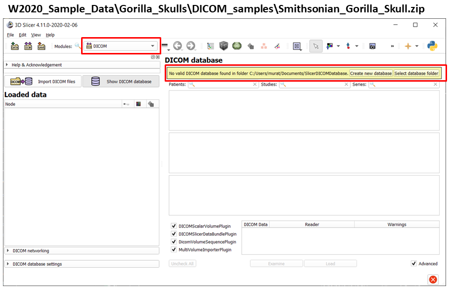
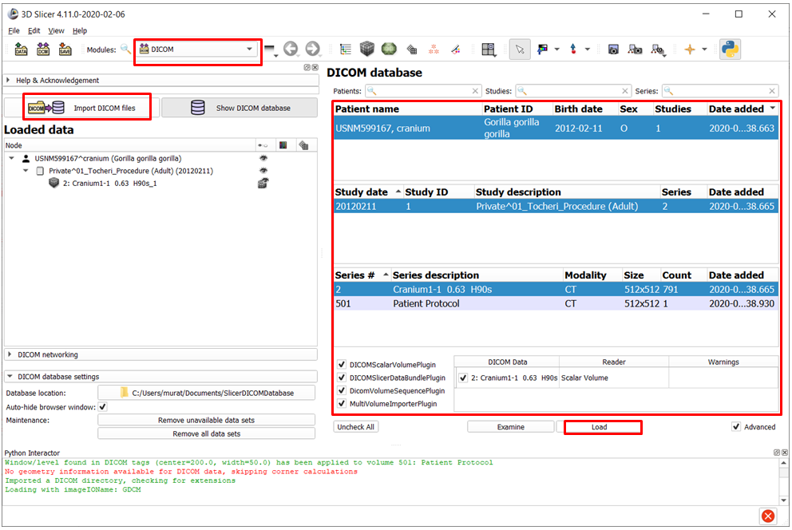
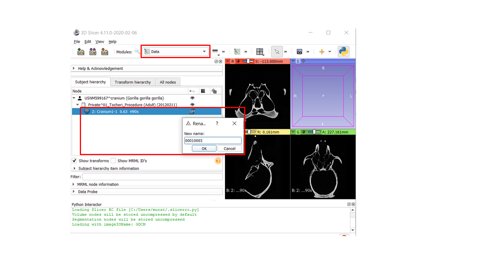

# Lab 02 Slicer#2: Data formats, importing data from MorphoSource, saving
* **image stacks vs volume files** We prefer to import the image sequences and save them as 3D volume to the convenience of working with single files. The primary reason for that, except for DICOM format, most 2D image format are not well-suited to preserve the geometry and resolution information of volumetric scans. That means, if you import and image sequence into Slicer/SlicerMorph, and not save it in a 3D volume format, next time you want to work on the same dataset you will have to redo the import steps. Therefore, we suggest the first step in your workflow immediate after importing your data is to save it in a volumetric format (see below).  

Additionally 3D Slicer would treat certain types of image sequences (namely JPG, PNG and BMO formats) as multichannel images, not scalar volumes. This creates additional complication and triples the memory requirement importing these data formats. Therefore, we developed a SlicerMorph specific module called `ImageStacks` to import these generic non-DICOM sequences. There is another SlicerMorph specific module called `SkyscanReconImport` which works solely for image sequences generated by the Bruker/SkyScan microCTs. 

In this lab we will review how to import non-DICOM stacks using both modules. (NOTE: If you are curious how these import functions compare to generic method offered by 3D Slicer you can review the previous iteration of this lab that used the generic functionality here https://github.com/SlicerMorph/S_2019/blob/master/Lab03_Slicer_2_data_formats_input_output/README.md#image-import-examples). 

## Two well-documented, and commonly supported image volume formats are:
* [Nearly Raw Raster Data: NRRD](http://teem.sourceforge.net/nrrd/format.html) Slicer's default volume format. 
* [Neuroimaging Informatics Technology Initiative: Nifti](https://nifti.nimh.nih.gov/)

* [List of image formats supported by Slicer](https://www.slicer.org/wiki/Documentation/Nightly/SlicerApplication/SupportedDataFormat)
* [pixel coordinates vs physical coordinates](https://www.slicer.org/wiki/Coordinate_systems)

## Image Import Examples
### Import non-DICOM image sequences using `ImageStacks` module

`ImageStacks` is a generic tool that can be used to import image sequences from mCT, MR, OPT or 3D microscopy (e.g., lightsheet or confocal).

1. Go to the `Sample Data` module of SlicerMorph, scroll down to find the SlicerMorph section of the `Sample Data` module 
2. Click on the **Bruker\SkyScan mCT Recon import** button to download the zip file into your SlicerMorph Cache folder. 

3. Unzip the contents of the archive to convenient location. Note that there is log file **P0_2_Rec.log** that contains important information about the scan. 
4. Switch to `ImageStacks` module and choose the files to import into SlicerMorph. 
5. Enter the voxel spacing information. (Browse the log file for this information)
5. Create a new volume node to contain this scan. 

7. Review the resultant image using the `Volumes` module.

### Import non-DICOM image sequences from Bruker\Skyscan using `SkyScanReconImport` module

1. Switch to `SkyScanReconImport` module.
2. Click the `...` button to navigate to the log file from the archive.
3. Hit Apply.

7. Review the resultant image using the `Volumes` module.

:pencil2: `SkyScanReconImport` works only for unmodified image stacks from Nrecon software. 

### Import a DICOM image Sequence

DICOM datasets should imported using the `DICOM` module. You can find extensive information about the `DICOM` module functionality at https://www.slicer.org/wiki/Documentation/Nightly/Modules/DICOM. Here we are providing a brief overview. 
From the sample data on your computer that you downloaded prior to the workshop (Gorilla_Skulls), locate this subfolder and file:
**Gorilla_Skulls/DICOM_samples/Smithsonian_Gorilla_Skull.zip** and unzip the sample DICOM sequence to convenient location on your computer (e.g., Desktop)

1. Open the `DICOM` module, you may receive a warning message about a DICOM Browser database creation and are asked to create folder to store the database. 

2. Click on the **Import DICOM files** button and navigate to the folder that contains the Gorilla skull DICOMs. It will parse contents (may take a while), and eventually you should see a database view that shows Patient Name field as USNM599167. At this point the DICOM sequence is imported into the DB, but haven't loaded into the Slicer yet. Highlight series #2, Cranium1-1 and click load.

## Renaming Volumes (or any nodes)
Sometimes import data (e.g., the DICOM sequence above) doesn't have a useful volume name. You can use the `Data` module to rename any data node loaded into Slicer by right-clicking on it and then choosing rename. Here I change the volume **Cranium1-1 0.63 H90s** to **00010003** (or whatever you would like). 

## Saving Data
Once you import an image sequence correctly, the very first thing you should do is to save it. At the minimum the Save As dialog box will contain two items; a MRML scene file and the actual volume. You can save either, or just choose to save the volume. MRML file would contain additional properties (e.g., the layout you are currently using, the lookup table you chose to visualizde your dataset, any measurements etc.).[You can find detailed explanation of `Save` dialog box here](https://www.slicer.org/wiki/Documentation/Nightly/SlicerApplication/SavingData). Here we are providing a short overview. 

## Reducing/Cropping Volumes
In addition to down sampling at the time of data import, you can also use Slicer's built-in modules to downsample your volume or get rid of regions that are of no interest to you. Below we cover both `ResampleScalarVolume` and the `Crop Volume` modules, both of which are core Slicer functions.   

### Downsamping Volumes via ResampleScalarVolume

* Load the file you saved in previous section (For me it is called *00010003.nrrd*) 
* Review the image spacing values for the original volume (HINT: Under `volumes` module, and for me they are 0.322x0.322x0.3mm)
* Search for `ResampleScalarVolume` module
* Set the input and output volume options and set your spacing option to something larger than your original volume (I used 0.5x0.5x0.5mm)
* Hit `Apply`

**You should now have a low-resolution version of your original volume.**

### Downsamping Volumes via CropVolume

* Load the file you saved in previous section (For me it is called *00010003.nrrd*) 
* Review the image spacing values for the original volume (HINT: Under `volumes` module, and for me they are 0.322x0.322x0.3mm)
* Search for `CropVolume` module
* Create ROI, hit the `Fit Volume` button
* Set the input and output volume options and set your spacing option to something larger than 1.0, if you want to reduce your dataset (I used 2)
* If you expand the `Volume Information` tab you should be able to set what the input volume dimensions were and what they would be in the cropped volume.
* Hit `Apply`

 

## Obtaining sample data from MorphoSource.
### 3D models
  * Go to https://www.morphosource.org/Detail/MediaDetail/Show/media_id/2095
  * Add the calcaneus **M2095-1895** to your cart (you should have an account on MorphoSource)
  * Agree to the terms and download. You should get a file called *Morphosource_amnh_mammals_m-188156_M2095-1895.zip*
  * Drag and drop that file to Slicer and answer the question about zip file contents as YES
  * In the Data dialog box, uncheck the ...USerAgreement.pdf (shows as a scalar overlay), and keep the other two checked
  * Hit OK
  
### Image sequences from MorphoSource.
While you can technically import the image sequences from MorphoSource exactly like the 3D model example shown before, due to the size of this zip files, we do not suggest it. This the suggested procedure:
 
1. Unzip the zip file that you downloaded from MorphoSource to convenient location on your computer (e.g., Desktop). 
2. Load the CSV file into SlicerMorph. 
3. Switch to `3D Table` view in the layout options
4. Enable the MorphoSource data table from `Data` Module, and review the table to locate the voxel spacing information.
5. Use the ImageStacks module to import the volume and use the voxel spacing reported in the CSV file.

  
 ## Work on your own. 
 * Alligator skull from sample data 
 
  
