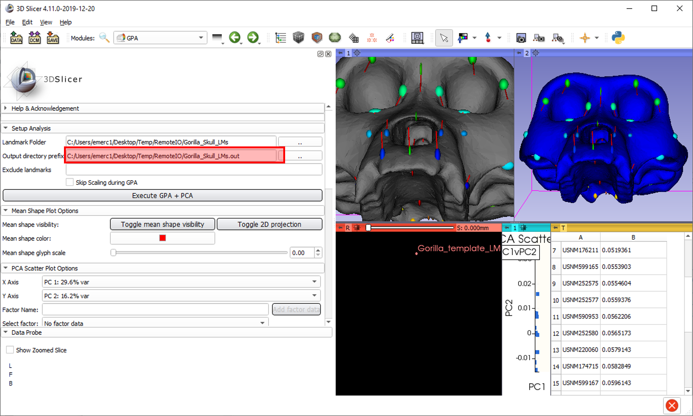
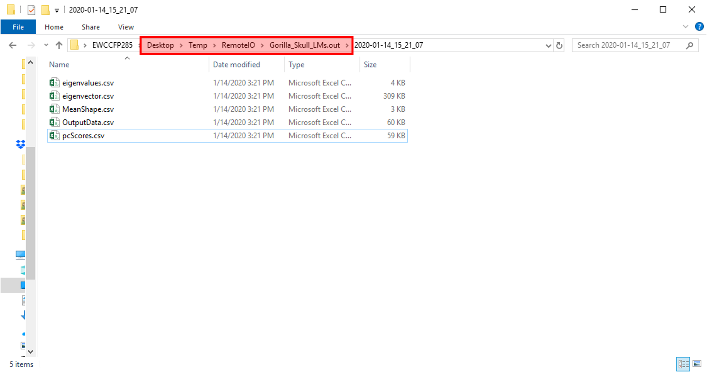

# Lab 8 Integrating SlicerMorph with R: 

## Requirements:

* Install R [here](https://cran.r-project.org/) and R Studio [here](https://rstudio.com/products/rstudio/).
   
* Open RStudio and install libraries geomorph and Morpho. 
    ```R
    install.packages('geomorph')
    install.packages('Morpho')
    ```
* Run SlicerMorph/GPA module on Gorilla dataset in Slicer.
    
## Brief Introduction to R and RStudio


Intro R resources:
- [stat545](https://stat545.com/r-basics.html)
- [Student's Guide to R](https://cran.r-project.org/doc/contrib/Horton+Pruim+Kaplan_MOSAIC-StudentGuide.pdf)
- [R Markdown: The Definitive Guide](https://bookdown.org/yihui/rmarkdown/)

## SlicerMorph outputs

This is where you left Gorilla example. If you want, re-run it and note the output directory.



Open the output directory and look at the results. What are these files?




## Import/Export Data into R 
* (read.csv, read.table)

## Intro to Geomorph/Morpho 
* Morpho::read.fcsv to import data from Slicer
* rerun the gorilla skulls sample dataset in geomorph and compare results.


### Please open the Exercise.Rmd in Rstudio and follow the tutorial.
