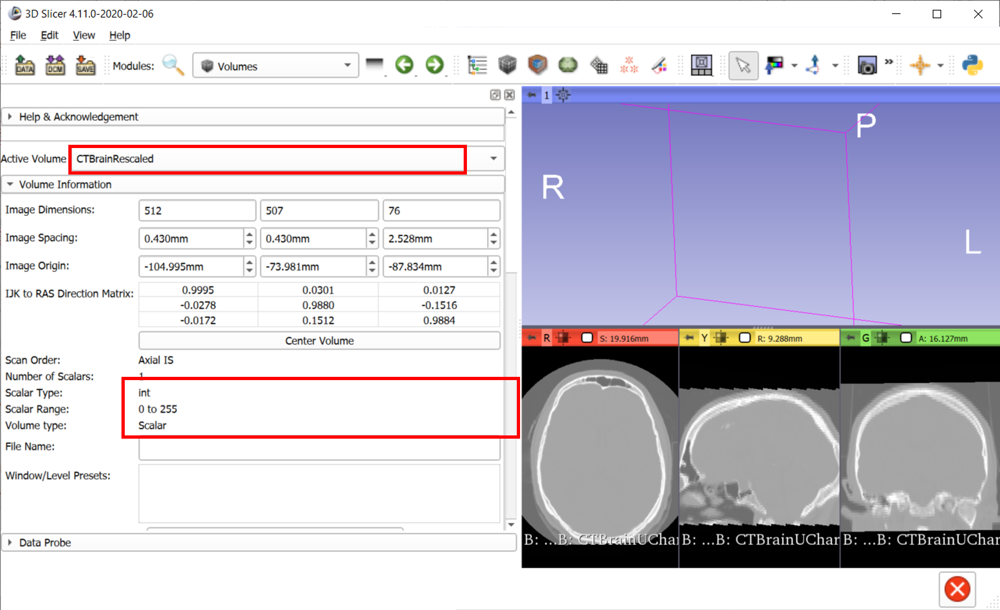
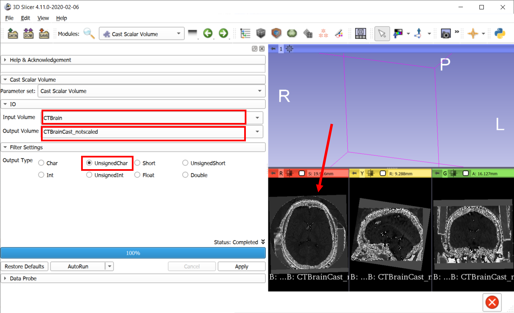

# Slicer++
## More About Volumes
### ``Volumes`` Module
Start by loading CT-MR-Brain data from ``Sample Data`` module.
Switch to ``Volumes`` module to look at the properties of these images.

### Rescale/Cast
Note: If your scalar volume data type is double (intensity range), you need to cast your image to an unsigned char (0-255) scalar volume. 
1. Find ``Simple Filters`` module, search for RescaleIntensityImageFilter and set the output intensity range to 0-255.
As output, create a new volume. This filter will map your original intensity range to 0-255 without truncating any intensities. 

2. Find ``Cast Scalar Volume`` module, set input volume to the output of previous module, and select your output data type, for this exercise, unsigned char which captures the intensity range 0-255. Hit apply.

Compare the data types and scalar ranges of three volumes:

Let's skip step 1 and run ``Cast Scalar Volume`` module directly on the CTBrain data, see what happens. Since we did not map the original intensity range to 0-255, it truncated anything below 0 and above 255, and we lost data.

## Volume Rendering
## LabelMap vs Segmentation vs Volume (Rendering) vs Model
## Transforms
### Fiducial Registration

## SlicerMorph: Animator
## SlicerMorph: Patch-based Semi-landmarking
## Extension Manager / Loading Extensions from github
