# Slicer++
## More About Volumes
### ``Volumes`` Module
Start by loading CT-MR-Brain data from ``Sample Data`` module.
Switch to ``Volumes`` module to look at the properties of these images. Change your 'Active Volume' to CTBrain, MRBrainT1 and MRBrainT2, and compare.

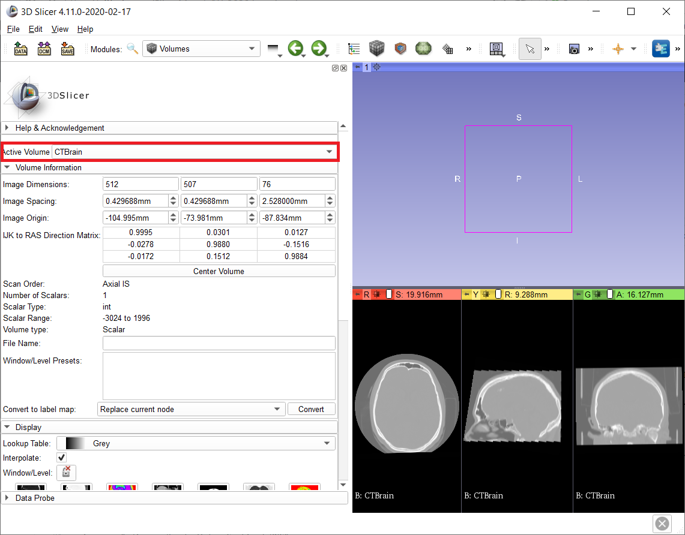

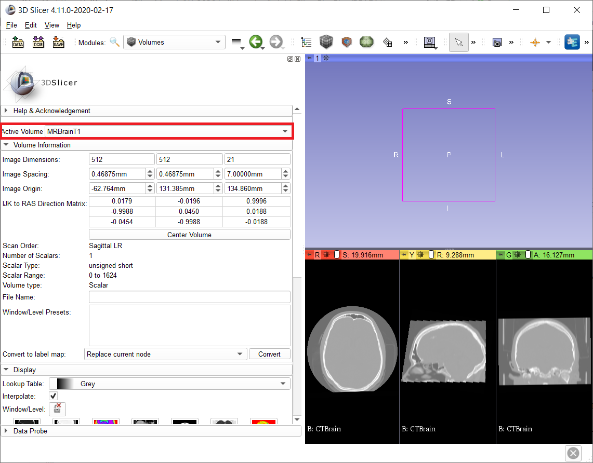

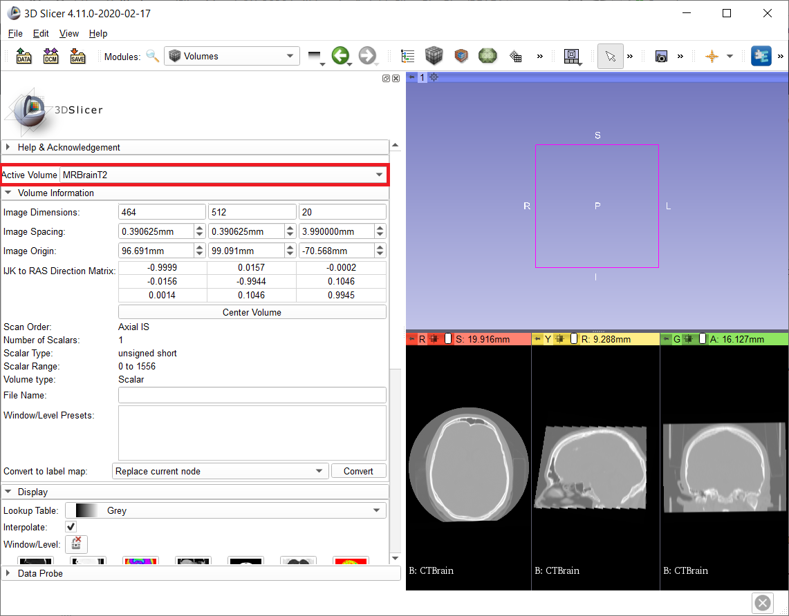

It's a good practice to check these for new volumes you load and make sure they are what you expect. 

### Rescale/Cast
Note: If your scalar volume data type is double (intensity range), you need to cast your image to an unsigned char (0-255) scalar volume. 
1. Find ``Simple Filters`` module, search for RescaleIntensityImageFilter and set the output intensity range to 0-255.
As output, create a new volume. This filter will map your original intensity range to 0-255 without truncating any intensities. 

2. Find ``Cast Scalar Volume`` module, set input volume to the output of previous module, and select your output data type, for this exercise, unsigned char which captures the intensity range 0-255. Hit apply.

Compare the data types and scalar ranges of three volumes:

Let's skip step 1 and run ``Cast Scalar Volume`` module directly on the CTBrain data, see what happens. Since we did not map the original intensity range to 0-255, it truncated anything below 0 and above 255, and we lost data.

## Volume Rendering
## Segmentation vs Volume Rendering vs Model

In 3D view, you can visualize a Segmentation, render a Volume or see a Model (mesh). Let's do all of these for the CTBrain data. 
1) In ``Segment Editor`` module, segment the skull using Threshold tool (243 to max), and click on 'View 3D'. 
2) Go to ``Segmentations`` module and export the skull segment as a Model. Slicer assigns the same color as your segment but to differentiate it from the Segmentation, let's change the color of the Model. Go to ``Models`` module and change the color of the skull model to red. 
3) Go to ``Volume Rendering`` module and select the CTBrain as Active Volume, turn on the visibility by clicking the eye icon. Select one of the first two Presets. It should render the skull in bone window, which starts at 243 Hounsfield Units for CT data. (That's why we used this value in thresholding)

Now you should have 3 different things on top of each other in 3D View. 

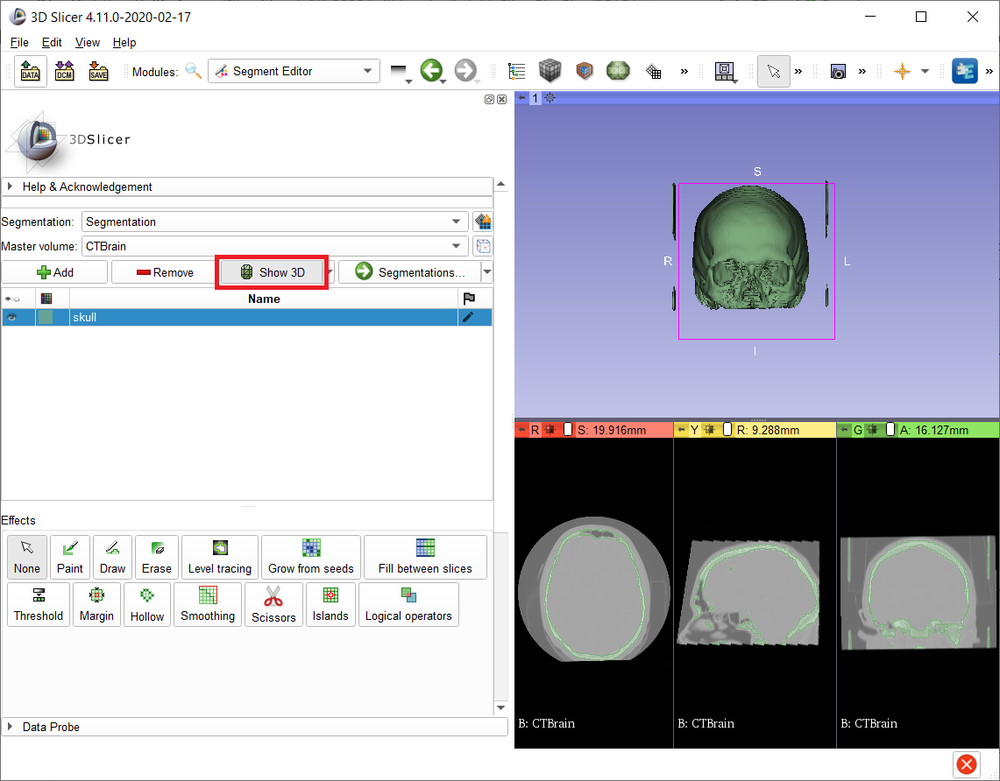

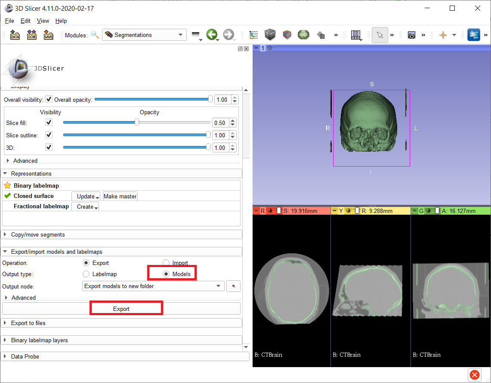

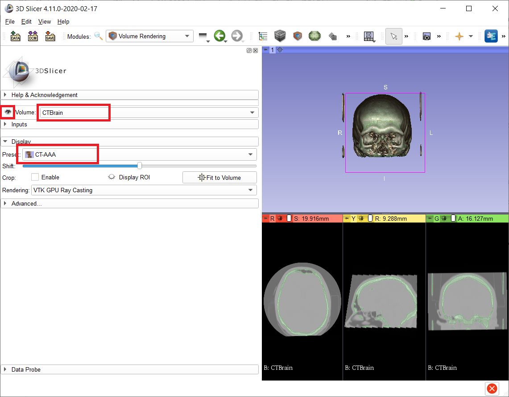

Go to ``Data`` module and try turning the visibilty on and off for Model, Segmentation and Volume. 

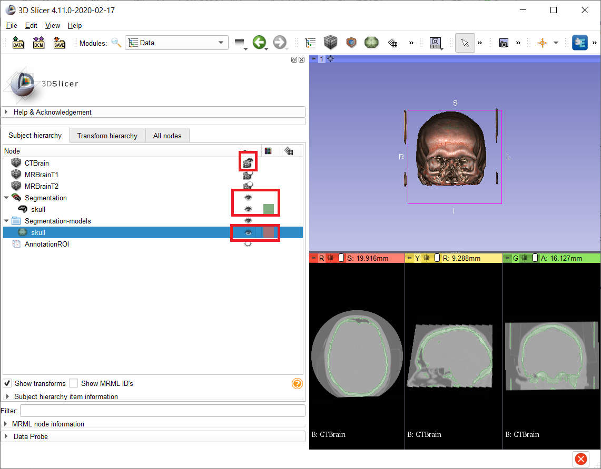

Let's talk about what's what. 
- A Segmentation is an abstract structure that you can visualize by clicking on the 'View 3D' button in ``Segment Editor``. This action DOES NOT create a surface mesh model. It is just a convenient way to see your Segmentation as you work on it. If you turn of smoothing (using the little menu next to the 'View 3D' button), you will see this 3D visualization doesn't have points and polygons, it is actually little cubes (voxels) from your volume (image) that are assigned the segment label. 
- Similarly, a volume rendering is just a visualization of the 3D volume (image) you loaded. It assigns specific colors and opacities to specific intensities through a 'transfer function' that shows up as a nice 3D visualization. Presets are just known nice functions for common data modalities. Again, ``Volume Rendering`` module DOES NOT create a surface mesh model or a segmentation. It just VISUALIZES your image. 
- You can export your segments as Models using ``Segmentations`` module. When you do this, it actually creates the points and polygons that is the surface mesh. Since surface meshes are not volumetric data, they are visible in the 3D View of the Slicer. But they are actual data structures you can save and modify in other mesh editor (or in Slicer to some extend). 

Long story short, there are a lot of different things that can look like a Model in 3D View. Make sure you know what you are visualizing. 

### LabelMaps

A 'model' is one of the data structures you can create from segmentations. The other one is a 'LabelMap'. Models are 3D surface meshes that are a bunch of points and polygons (connectivity). If you want to stay in the volumetric realm, we are talking about LabelMaps. A label map is a volume (an image) with label values (segments) instead of intensities. 

You can save the LabelMap as an image (.nrrd, .nii etc). If you don't forget to assign the master volume during export, it will have the same dimensions and spacing as your original volume. 

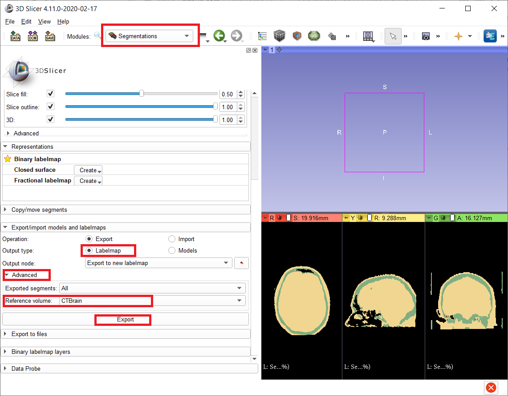

Slicer adds "-label" suffix to LabelMaps automatically when saving, you can change this but when you load a LabelMap from the disk, if it has "-label" suffix in the filename, Slicer recognizes it as a LabelMap automatically. Otherwise, you need to expand the options in the Load menu and check the "LabelMap" checkbox to tell Slicer that the volume you are loading is a LabelMap.

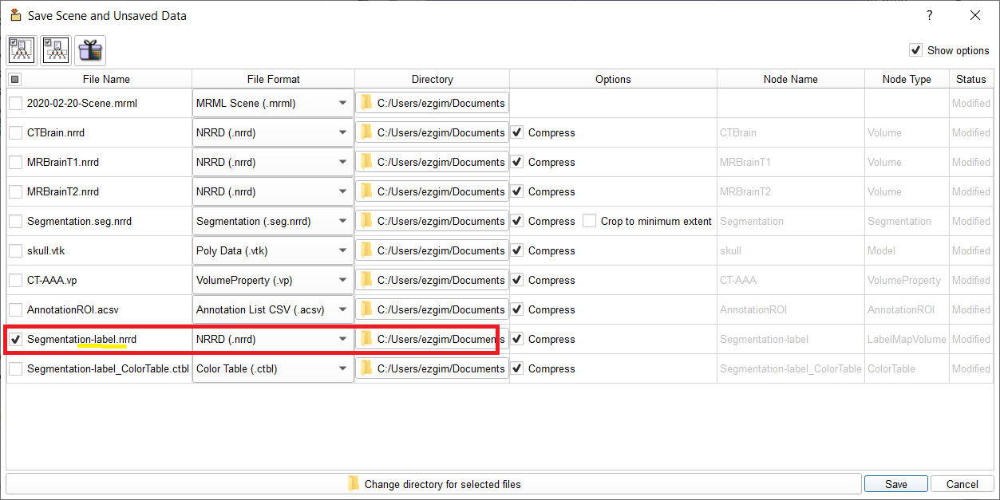
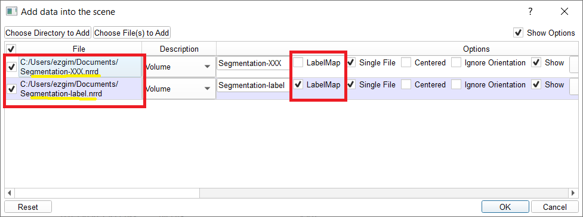

Since a LabelMap is an image, it can only have one value per voxel, so if your segments are overlapping - then the one that comes later in the list will be the label at the intersection areas. 

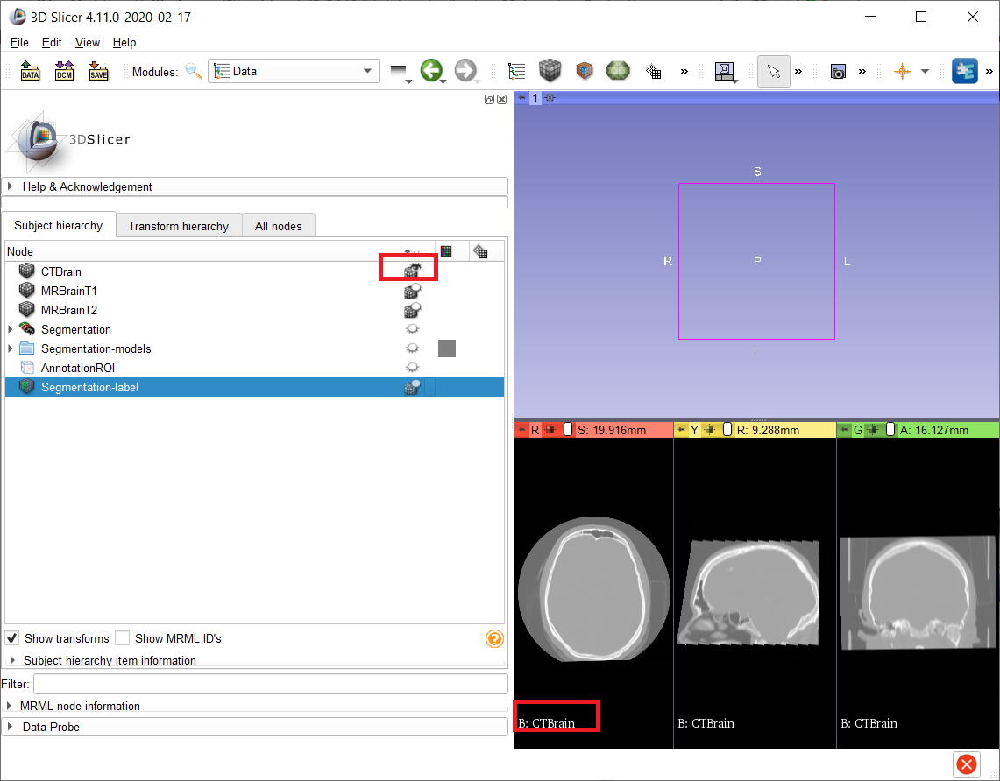
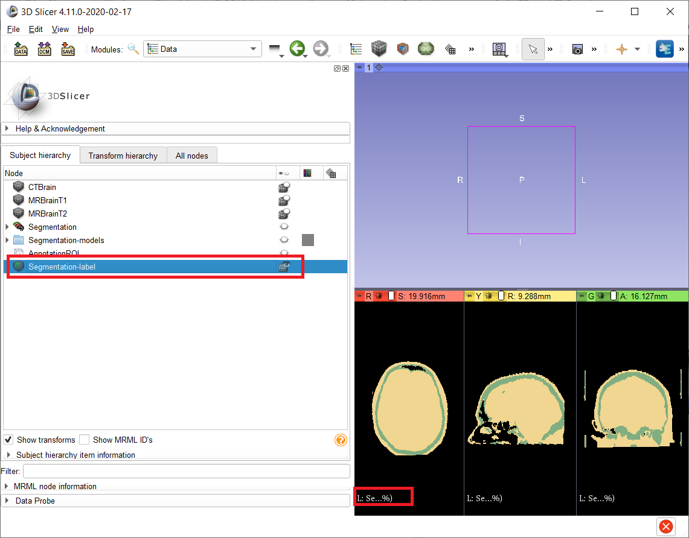

## Transforms
### Fiducial Registration

## SlicerMorph: Animator
## SlicerMorph: Patch-based Semi-landmarking
## Extension Manager / Loading Extensions from github
