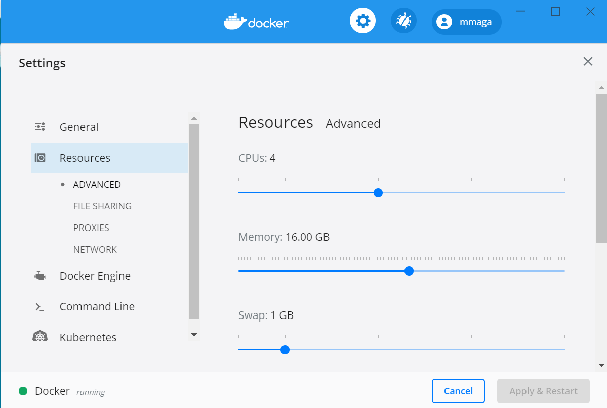
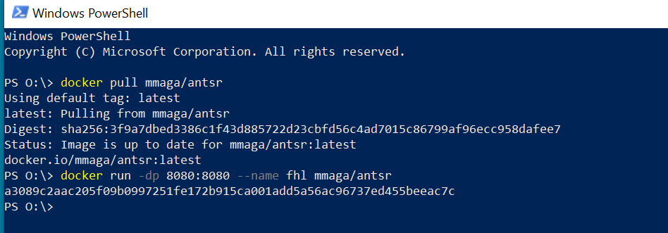
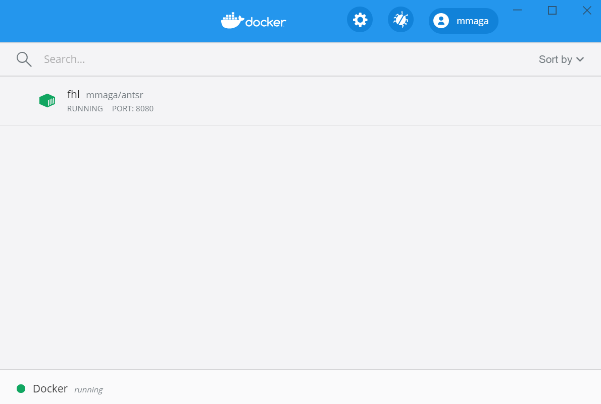
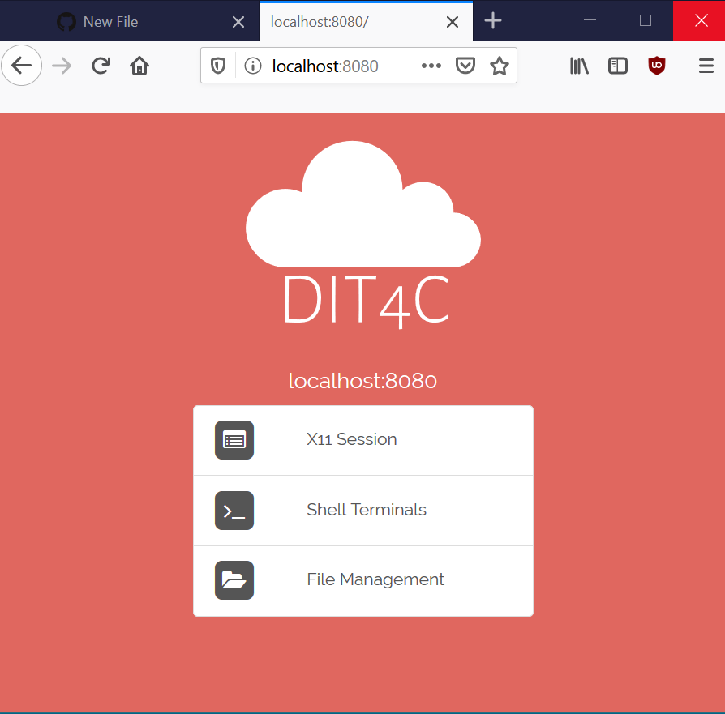
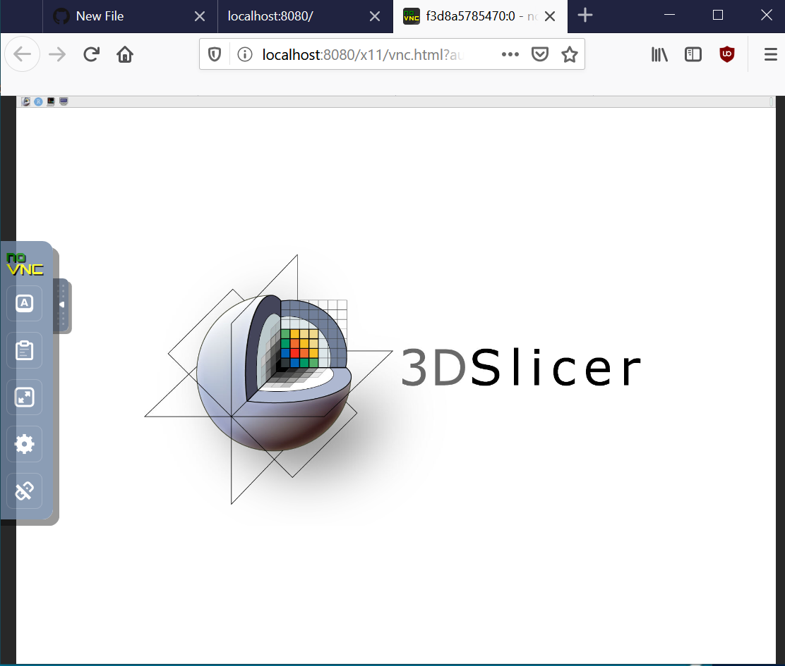

# Setting up your Docker:
1. Start the docker Desktop application (may take a few minutes)
2. Click on the docker app icon in the tray and choose **Settings**

3. Click on the **ADVANCED** tab and make sure you assign at least of half the available CPUs and Memory to Docker. Click Apply & Restart
4. Open **PowerShell** (Windows) or **Terminal** (Mac) window and type these commands. In Mac you will have to add sudo to these commands

docker pull mmaga/antsr

(this may take a while depending on your internet connection)

docker run -dp 8080:8080 --name fhl mmaga/antsr

5. Click the docker icon to switch to **Dashboard** view and see the **fhl** container is running.

6. Open a web browser and type http://localhost:8080 in the address window. This should bring a webpage that looks like this:

7. Click on **X11 Session** which should open a new page that will be running a linux desktop with all the tools preloaded.

